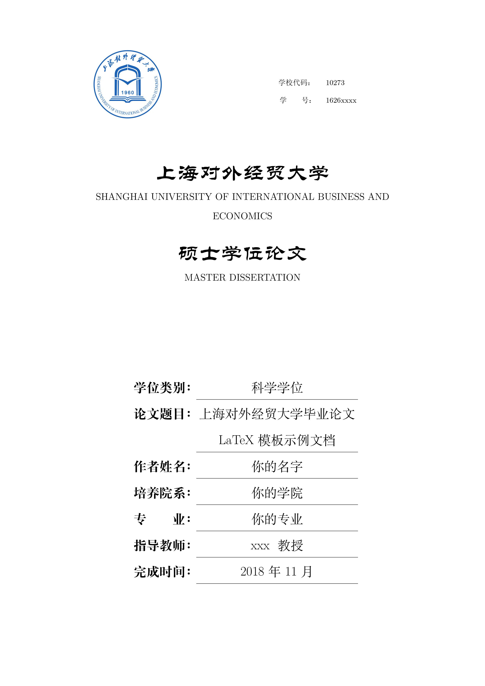
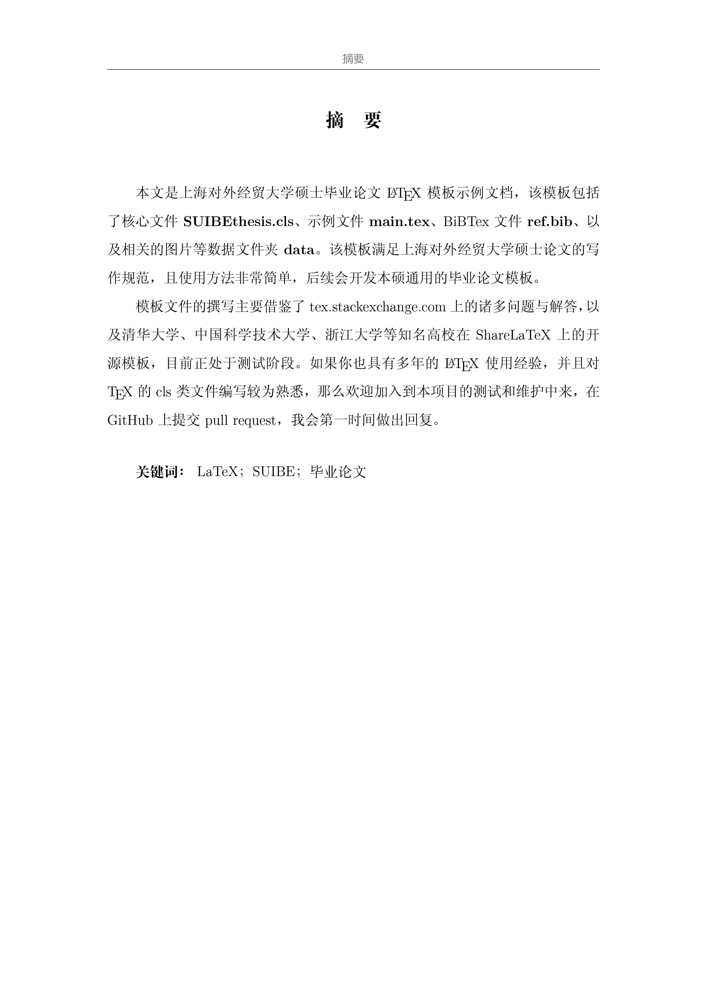
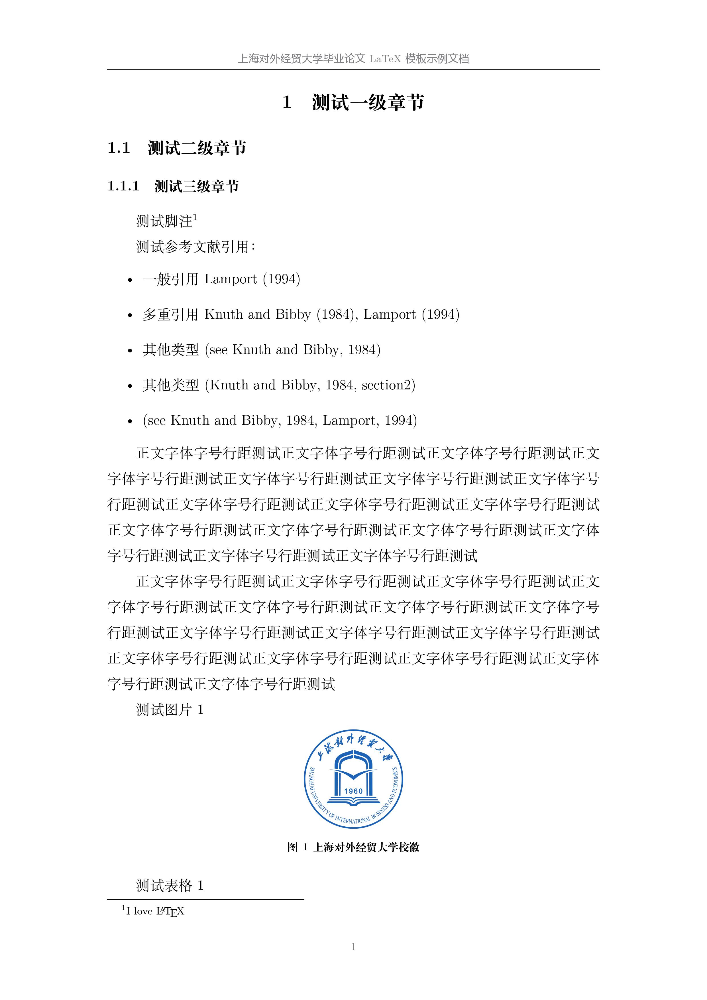
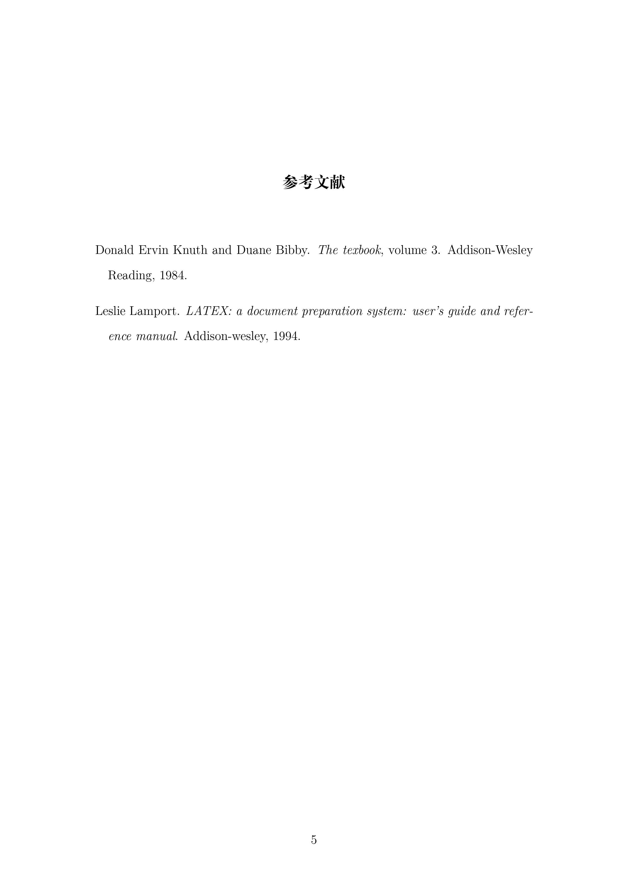

# 上海对外经贸大学研究生毕业论文Latex模板

编译环境：
- textlive 2017
- Arch Linux: manjaro

windows版本我后面会继续调试，不过因为用的都是win下的字体，我觉得应该没啥问题

 
 

# TODO:

- [ ] 参考文献算入页数
- [ ] 适配windows字体
- [ ] windows下编译调试
- [x] 加入致谢
- [x] 目录字体和标题一致
- [ ] (someday)参考文件前面加入方框和编号

